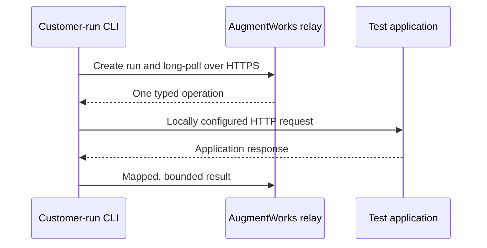

# AugmentWorks CLI

[](https://github.com/jeffskafi/augmentworks-cli/actions/workflows/ci.yml)

`@augmentworks/cli` is a deterministic, customer-operated connector for
stateful AI agent release testing. It maps fixed assessment operations to an
application on localhost, a private network, or another customer-configured
endpoint using versioned YAML. The same connector supports two explicit modes:

- `test --local` loads and scores a data-only packet entirely in the customer
  environment. It requires no AugmentWorks account and contacts no
  AugmentWorks service.
- `test` starts a hosted AugmentWorks assessment, exchanges bounded evidence
  through the outbound HTTPS relay, and shows the result in the dashboard.

The generic HTTP connector does not require a Python adapter or AugmentWorks
target SDK, and no coding assistant is used in either runtime path.

## Local quickstart

Prerequisites: Node.js 20 or newer and an authorized, isolated synthetic test
target. No AugmentWorks account, login, credit, relay, or dashboard is required.

```bash
npx --yes @augmentworks/cli@0.2.0 init --agent
# Edit augmentworks.yaml and .env

npx --yes @augmentworks/cli@0.2.0 doctor \
  -c augmentworks.yaml

npx --yes @augmentworks/cli@0.2.0 test \
  --local \
  -c augmentworks.yaml \
  --packet support-refunds-starter@0.1.0 \
  --open
```

`init` creates the YAML, `.env.example`, a local `.env`, and repository
guidance. On POSIX systems, the CLI creates `.env` with mode `0600`. `doctor`
validates the config and local prerequisites without calling AugmentWorks or
the target. `test --local` then calls only the target selected by the local
configuration and writes private JSON, JUnit, and static HTML reports beneath
`.augmentworks/runs/<run_id>/`. `--open` opens that static HTML file.

“Local” describes the AugmentWorks boundary, not an air gap. The CLI makes no
AugmentWorks control-plane request, but the configured target may itself be a
network service and may call models or other dependencies.

## Hosted quickstart

Hosted assessment prerequisites add an AugmentWorks workspace and connector
authorization:

```bash
npx --yes @augmentworks/cli@0.2.0 login

npx --yes @augmentworks/cli@0.2.0 test \
  -c augmentworks.yaml \
  --packet support-refunds@0.1.0 \
  --open
```

Without `--local`, `test` starts a hosted assessment and `--open` opens its live
dashboard. The hosted packet and scorer remain in AugmentWorks.

For an SSH or otherwise headless environment, use device authorization:

```bash
npx --yes @augmentworks/cli@0.2.0 login --device
```

Interactive credentials use the macOS login Keychain, Windows CurrentUser
DPAPI, or the Linux Secret Service when available. On POSIX systems only, an
explicit `--allow-file-credentials` opt-in enables a warned mode-`0600` local
file when no native store is available. Plaintext fallback is disabled on
Windows because POSIX file modes cannot establish a safe Windows ACL.

Do not put an AugmentWorks token on the command line. Long-lived project-token
issuance is not part of the interactive connector-auth release, so do not
substitute its one-hour interactive access token for an unattended CI
credential. `AUGMENTWORKS_TOKEN` remains reserved for future project tokens and
local integration harnesses.

## Configuration

The CLI loads `.env` from the directory containing the selected config. YAML
contains environment-variable **names**, never credential values.

```yaml
version: 1

target:
  name: refunds-staging
  connector: http
  base_url: ${CHATBOT_BASE_URL}

  auth:
    bearer_env: CHATBOT_API_KEY

  operations:
    prepare:
      method: POST
      path: /__augmentworks/prepare
      idempotent: true
      request:
        attempt_id: $input.attempt_id
        fixture: $input.fixture
      response:
        status: $.status

    send:
      method: POST
      path: /chat
      idempotent: false
      request:
        message: $input.message.content
        turn_id: $input.turn_id
        attempt_id: $input.attempt_id
      response:
        content: $.answer
        tool_events: $.events
        finished: $.finished

    observe:
      method: POST
      path: /__augmentworks/observe
      idempotent: true
      request:
        attempt_id: $input.attempt_id
        probe_keys: $input.probe_keys
      response:
        order.status: $.order.status
        order.refunded_amount: $.order.refunded_amount
        order.refundable: $.order.refundable

    cleanup:
      method: POST
      path: /__augmentworks/cleanup
      idempotent: true
      request:
        attempt_id: $input.attempt_id

telemetry:
  allow_tool_events: true
  allow_observations:
    - order.status
    - order.refunded_amount
    - order.refundable
```

```dotenv
# .env
CHATBOT_BASE_URL=http://127.0.0.1:8000
CHATBOT_API_KEY=replace-locally
```

See the [configuration reference](https://github.com/jeffskafi/augmentworks-cli/blob/main/docs/configuration.md), the versioned
[`augmentworks.yaml` schema](schemas/v1/augmentworks.schema.json), and the
[refund-agent example](https://github.com/jeffskafi/augmentworks-cli/blob/main/examples/refund-agent/README.md).

## Data boundary

| Mode | AugmentWorks contact | Evidence boundary |
| --- | --- | --- |
| Local (`test --local`) | None | Packet inputs, mapped responses, tool events, observations, scoring, and reports stay in the customer environment. Only the locally configured target is contacted. |
| Hosted (`test`) | Outbound HTTPS authentication and relay | Raw target boundary and secrets stay local. Bounded packet inputs and mapped, allowlisted evidence are exchanged with AugmentWorks. |

The connector credential created by `login` authenticates the CLI to
AugmentWorks. Target authentication is separate: YAML names local environment
variables whose values are used only for CLI-to-target requests.

## What happens during hosted `test`



1. The CLI authenticates and creates an assessment run.
2. It long-polls the relay over outbound HTTPS; no inbound port or tunnel is
   required.
3. The relay can request only `prepare`, `send`, `observe`, or `cleanup`.
4. Local configuration—not a cloud command—selects the URL, method, headers,
   environment variables, and response mapping.
5. The CLI returns only mapped assistant content, opted-in tool events,
   allowlisted observations, safe errors, and lifecycle status.
6. AugmentWorks evaluates that evidence and updates the dashboard.
7. When a fixture may exist, the hosted relay can dispatch a typed `cleanup`
   follow-up after success, failure, cancellation, or interruption. The CLI
   does not invent lifecycle operations that the relay did not dispatch.

The relay delivers commands at least once. The CLI journals command IDs and
returns a durable terminal result for an exact duplicate. It never blindly
retries an ambiguous operation unless local configuration explicitly declares
that operation idempotent.

Before run creation, `test` validates the config locally, resolves the current
workspace and connector identity, and persists a secret-free active intent.
Re-running the exact command on the same machine resumes the same run. A
different active packet, configuration, connector, or workspace is refused
instead of silently creating another run or reserving another credit.

## What happens during `test --local`

1. The CLI validates the YAML, resolves target credentials locally, and loads
   either the bundled `support-refunds-starter@0.1.0` packet or a local
   `packet.json`.
2. It verifies that the configured lifecycle mappings and telemetry allowlist
   satisfy the packet's declared capabilities.
3. It executes attempts serially: `prepare`, one or more `send` operations,
   `observe`, and `cleanup` in a `finally` path.
4. It deterministically evaluates the packet assertions and writes
   `report.json`, `junit.xml`, and `report.html` to a fresh private directory.
5. If `--open` is present, it opens the generated static HTML report. No
   dashboard or hosted evidence record is created.

The CLI does not blindly retry an ambiguous non-idempotent operation. It still
attempts observation when a send outcome is ambiguous and attempts cleanup when
a fixture may exist. A cleanup failure stops new attempts. The first Ctrl+C
requests cancellation and drains cleanup; a second exits immediately. A hard
process or machine failure cannot guarantee cleanup, so synthetic fixtures need
an independent server-side TTL. New target work is bounded by a 30-minute local
run deadline; bounded cleanup is still allowed to drain after that deadline.

### Local packets

Local packets use the strict `aw-packet/0.1` JSON format. They are data, not
executable plugins: no JavaScript, modules, shell commands, remote URLs, or
download step is accepted. `--packet` may name the bundled
`support-refunds-starter@0.1.0`, a local JSON file, or a local directory
containing `packet.json`.

Print the packet and result schemas with:

```bash
npx --yes @augmentworks/cli@0.2.0 schema --kind local-packet
npx --yes @augmentworks/cli@0.2.0 schema --kind local-result
```

### Local reports and trust

The default exact output directory is `.augmentworks/runs/<run_id>`. Override
it with `--output-dir <path>`; the selected leaf must not already exist, and the
CLI never merges into or overwrites an existing directory. On POSIX systems the
leaf is mode `0700` and report files are mode `0600`.

Every local report is labeled:

> Local, customer-executed result. AugmentWorks did not receive or independently verify this run. This artifact is unsigned and is not a certification, audit, or hosted evidence record.

The JSON uses `AW-LOCAL-RESULT-1` and includes a SHA-256 change-detection
checksum. That checksum is not a signature or proof of provenance. The HTML is
a self-contained static file with no scripts or external assets. Treat all
three artifacts as sensitive customer-controlled evidence. `--json` emits the
same final local result on stdout; the three files are still generated.

## Commands

| Command | Purpose | Side effects |
| --- | --- | --- |
| `login [--device] [--allow-file-credentials]` | Authorize this machine | Opens a browser by default and stores a revocable credential |
| `logout` | Revoke and remove the connector credential | Requests server-side revocation and deletes local credential material |
| `whoami` | Show the current workspace identity | Reads cloud identity; may refresh and update the local connector credential |
| `init [-c path] [--agent] [--force]` | Generate config and setup guidance | Does not overwrite files unless `--force` is explicit |
| `doctor [-c path] [--offline]` | Validate config, mappings, secrets, and local prerequisites | Makes no network calls, invokes no lifecycle hook, and consumes no assessment credit |
| `test [-c path] --packet name@version [--open]` | Run one hosted assessment | Authenticates to AugmentWorks, calls configured lifecycle endpoints, and may create synthetic state |
| `test --local [-c path] --packet reference [--output-dir path] [--open] [--json]` | Run and score a customer-executed local assessment | Contacts only the configured target and writes local artifacts; no AugmentWorks account or service is used |
| `schema [--kind config\|local-packet\|local-result]` | Print a bundled v1 JSON Schema | None |

### Exit codes

| Code | Meaning |
| --- | --- |
| `0` | Assessment passed |
| `1` | Internal or report-generation failure |
| `2` | Configuration, packet, capability, or output preflight failure |
| `3` | Hosted authentication failure; unreachable from `--local` |
| `4` | Hosted relay/protocol failure; unreachable from `--local` |
| `5` | Target, protocol-evidence, or indeterminate execution error |
| `6` | Cleanup failure; takes precedence over assessment status |
| `10` | Assertions failed or the assessment was inconclusive |
| `130` | Interrupted after cleanup was drained; a second interrupt exits immediately |

## Evidence levels

| Level | Required mapping | Evidence claim |
| --- | --- | --- |
| Chat-only | `send` request and response | Conversational behavior |
| Tool-aware | `send` plus structured tool events | What the chatbot attempted to invoke |
| Stateful | `prepare`, `send`, `observe`, and `cleanup` | Values returned by the configured synthetic-state observer |

For consequential workflows, an agent saying “done” is not proof. Stateful
evidence requires configured observation and cleanup hooks. A hosted run records
what the customer-controlled observer reports in AugmentWorks; a local run
records it only in the customer-held reports. Neither mode independently proves
that the observer is truthful or that staging matches production.

## Security and trust boundary

- The CLI accepts only typed lifecycle operations. It does not accept shell
  commands, file instructions, arbitrary URLs, methods, headers, or modules from
  the relay.
- Secrets are resolved locally and redacted from diagnostics. Interactive
  credentials use the operating-system credential store when available.
- Telemetry is opt-in and allowlisted. Run preflight sends sorted public
  observation aliases—not values, selectors, environment-variable names, or
  target URLs. Request and response sizes, timeouts, and nesting are bounded.
- Run preflight sends an unkeyed checksum of the resolved target boundary, not
  its raw URL or paths. It detects boundary drift across local restart; it is
  not target identity, ownership, code, state, or execution proof.
- Executed prompts and synthetic fixtures are visible to the local connector;
  undispatched packet branches and hosted assertions can remain private.
- A local packet is fully visible to the customer process, and its unsigned
  report is customer-controlled. It must not be presented as hosted or
  independently verified AugmentWorks evidence.
- The CLI's unkeyed SHA-256 digests detect a conflicting replay when compared
  with an already-durable local or relay record; they are not evidence
  signatures. The hosted relay associates accepted results with authenticated
  connector, session, run, packet, configuration, and sequence bindings.
- A customer-operated observation hook can be incorrect or dishonest, and a
  staging result is not proof of production equivalence.
- v0.2 is for authorized, isolated synthetic targets in test or staging
  environments and synthetic test data only. Do not connect production systems
  or use production or regulated data.

Read the complete [security model](https://github.com/jeffskafi/augmentworks-cli/blob/main/docs/security-model.md),
[relay protocol](https://github.com/jeffskafi/augmentworks-cli/blob/main/docs/protocol.md), and
[security policy](SECURITY.md).

## Current limitations

- The generic HTTP connector is the only v0.2 connector.
- OpenAPI import, OpenAI-compatible presets, LangServe, and custom modules are
  not implemented.
- v0.2 exposes no public `connect` command; hosted `test` keeps the connector
  online only for the assessment it starts.
- Pointing the CLI directly at a model provider tests the model endpoint, not
  the customer's policies, tools, database, or application behavior.

## Development

```bash
npm ci
npm run typecheck
npm test
npm run build
npm run smoke:pack
```

See [CONTRIBUTING.md](https://github.com/jeffskafi/augmentworks-cli/blob/main/CONTRIBUTING.md)
for repository conventions and the
[agent setup guide](https://github.com/jeffskafi/augmentworks-cli/blob/main/docs/agent-setup.md)
for a safe coding-assistant workflow.

## Compatibility and releases

The package requires Node.js 20+. Configuration and relay envelopes carry an
explicit protocol version. Patch releases remain compatible with their v1
schema; incompatible configuration or protocol changes require a new version.
Published releases are expected to use npm trusted publishing with provenance.

See [CHANGELOG.md](https://github.com/jeffskafi/augmentworks-cli/blob/main/CHANGELOG.md)
for release notes.

## License

Apache-2.0. See [LICENSE](LICENSE).
