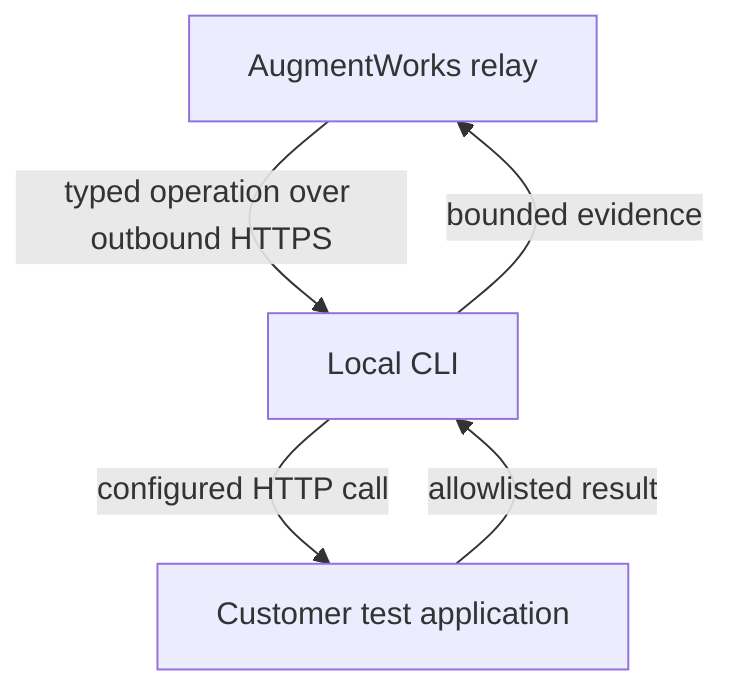

# AugmentWorks CLI

[](https://github.com/jeffskafi/augmentworks-cli/actions/workflows/ci.yml)

`@augmentworks/cli` is the deterministic, customer-operated connector that lets
AugmentWorks assess chatbots running on localhost or inside a private network.
It converts fixed assessment operations into calls to your application using a
versioned YAML file. No model is used in the evidence path.

> **Beta status:** the CLI and its local mock end-to-end lifecycle are under
> active development. The production AugmentWorks connector-auth and relay
> service is **not deployed yet**, so `login` and hosted `test` cannot currently
> complete against `augmentworks.ai`. The commands below are the pinned v0.1
> interface and are exercised against a mock relay in this repository.

## Quickstart

Prerequisites: Node.js 20 or newer, an AugmentWorks workspace, and a synthetic
test target. When the v0.1 package and production relay are live, run:

```bash
npx --yes @augmentworks/cli@0.1.0 login

npx --yes @augmentworks/cli@0.1.0 init --agent
# Edit augmentworks.yaml and .env

npx --yes @augmentworks/cli@0.1.0 doctor \
  -c augmentworks.yaml

npx --yes @augmentworks/cli@0.1.0 test \
  -c augmentworks.yaml \
  --packet support-refunds@0.1.0 \
  --open
```

For an SSH or otherwise headless environment, use device authorization:

```bash
npx --yes @augmentworks/cli@0.1.0 login --device
```

If no supported OS credential store is available, `login` fails safely unless
you explicitly opt into the warned local-file fallback with
`--allow-file-credentials`. On POSIX systems that file is restricted to mode
`0600`.

Do not put an AugmentWorks token on the command line. For CI, supply
`AUGMENTWORKS_TOKEN` through the CI provider's secret store:

```bash
AUGMENTWORKS_TOKEN="$AUGMENTWORKS_TOKEN" \
npx --yes @augmentworks/cli@0.1.0 test \
  -c augmentworks.yaml \
  --packet support-refunds@0.1.0
```

## Configuration

The CLI loads `.env` from the directory containing the selected config. YAML
contains environment-variable **names**, never credential values.

```yaml
version: 1

target:
  name: refunds-staging
  connector: http
  base_url: ${CHATBOT_BASE_URL}

  auth:
    bearer_env: CHATBOT_API_KEY

  operations:
    prepare:
      method: POST
      path: /__augmentworks/prepare
      idempotent: true
      request:
        attempt_id: $input.attempt_id
      response:
        status: $.status

    send:
      method: POST
      path: /chat
      idempotent: false
      request:
        message: $input.message.content
        turn_id: $input.turn_id
        attempt_id: $input.attempt_id
      response:
        content: $.answer
        tool_events: $.events
        finished: $.finished

    observe:
      method: POST
      path: /__augmentworks/observe
      idempotent: true
      request:
        attempt_id: $input.attempt_id
        probe_keys: $input.probe_keys
      response:
        order.status: $.order.status
        order.refunded_amount: $.order.refunded_amount

    cleanup:
      method: POST
      path: /__augmentworks/cleanup
      idempotent: true
      request:
        attempt_id: $input.attempt_id

telemetry:
  allow_tool_events: true
  allow_observations:
    - order.status
    - order.refunded_amount
```

```dotenv
# .env
CHATBOT_BASE_URL=http://127.0.0.1:8000
CHATBOT_API_KEY=replace-locally
```

See the [configuration reference](https://github.com/jeffskafi/augmentworks-cli/blob/main/docs/configuration.md), the versioned
[`augmentworks.yaml` schema](schemas/v1/augmentworks.schema.json), and the
[refund-agent example](https://github.com/jeffskafi/augmentworks-cli/blob/main/examples/refund-agent/README.md).

## What happens during `test`



1. The CLI authenticates and creates an assessment run.
2. It long-polls the relay over outbound HTTPS; no inbound port or tunnel is
   required.
3. The relay can request only `prepare`, `send`, `observe`, or `cleanup`.
4. Local configuration—not a cloud command—selects the URL, method, headers,
   environment variables, and response mapping.
5. The CLI returns only bounded messages, tool events, and allowlisted state.
6. AugmentWorks evaluates that evidence and updates the dashboard.
7. When a fixture may exist, the hosted relay can dispatch a typed `cleanup`
   follow-up after success, failure, cancellation, or interruption. The CLI
   does not invent lifecycle operations that the relay did not dispatch.

The relay delivers commands at least once. The CLI journals command IDs and
returns a durable terminal result for an exact duplicate. A previously started
operation without a durable result executes again only when configuration marks
it idempotent. The CLI never blindly retries an ambiguous operation that is not
explicitly idempotent; it reports an indeterminate outcome so the relay can
dispatch bounded typed follow-ups, such as `observe` or `cleanup` when a fixture
may exist.

Before the create request, `test` persists one secret-free active intent per
AugmentWorks API origin. Re-running the exact command on the same machine
replays the same create ID and resumes the same run; a different request is
refused until the first run reaches an authoritative terminal status. There is
no force-new bypass, and recovery proceeds only when secure local lock ownership
can be positively established. Under the hosted protocol, create preflight
happens before credit reservation, the first real command lease consumes the
credit, and cancellation or expiry before that lease releases it. A create
replay never charges again. The production service implementing this contract
is not yet deployed.

## Commands

| Command | Purpose | Side effects |
| --- | --- | --- |
| `login [--device] [--allow-file-credentials]` | Authorize this machine | Opens a browser by default and stores a revocable credential |
| `logout` | Revoke and remove the connector credential | Requests server-side revocation and deletes local credential material |
| `whoami` | Show the current workspace identity | Network read only |
| `init [-c path] [--agent] [--force]` | Generate config and setup guidance | Does not overwrite files unless `--force` is explicit |
| `doctor [-c path] [--offline]` | Validate config, mappings, secrets, and local prerequisites | Makes no network calls, invokes no lifecycle hook, and consumes no assessment credit |
| `test [-c path] --packet name@version [--open]` | Run one hosted assessment | Calls configured lifecycle endpoints and may create synthetic state |
| `schema` | Print the bundled v1 JSON Schema | None |

## What an integration can prove

| Level | Required mapping | Evidence claim |
| --- | --- | --- |
| Chat-only | `send` request and response | Conversational behavior |
| Tool-aware | `send` plus structured tool events | What the chatbot attempted to invoke |
| Stateful | `prepare`, `send`, `observe`, and `cleanup` | What changed in a synthetic system, according to the configured observer |

For consequential workflows, a chatbot saying “done” is not proof. A stateful
packet requires an authoritative observation and cleanup hook.

## Security and trust boundary

- The CLI accepts only typed lifecycle operations. It does not accept shell
  commands, file instructions, arbitrary URLs, methods, headers, or modules from
  the relay.
- Secrets are resolved locally and redacted from diagnostics. Interactive
  credentials use the operating-system credential store when available.
- Telemetry is opt-in and allowlisted. Run preflight sends sorted public
  observation aliases—not values, selectors, environment-variable names, or
  target URLs. Request and response sizes, timeouts, and nesting are bounded.
- Run preflight sends an unkeyed checksum of the resolved target boundary, not
  its raw URL or paths. It detects boundary drift across local restart; it is
  not target identity, ownership, code, state, or execution proof.
- Executed prompts and synthetic fixtures are visible to the local connector;
  undispatched packet branches and hosted assertions can remain private.
- The CLI's unkeyed SHA-256 digests detect a conflicting replay when compared
  with an already-durable local or relay record; they are not evidence
  signatures. HTTPS authenticates the transport endpoint. The undeployed hosted
  evidence service would need separate authenticated bindings or signing to
  provide provenance or tamper-evidence.
- A customer-operated observation hook can be incorrect or dishonest, and a
  staging result is not proof of production equivalence.
- v0.1 is for synthetic test data in test or staging environments. Production
  execution is unsupported.

Read the complete [security model](https://github.com/jeffskafi/augmentworks-cli/blob/main/docs/security-model.md),
[relay protocol](https://github.com/jeffskafi/augmentworks-cli/blob/main/docs/protocol.md), and
[security policy](SECURITY.md).

## Current limitations

- The generic HTTP connector is the only v0.1 connector.
- OpenAPI import, OpenAI-compatible presets, LangServe, and custom modules are
  not implemented.
- An always-online `connect` mode is intentionally deferred.
- Pointing the CLI directly at a model provider tests the model endpoint, not
  the customer's policies, tools, database, or application behavior.
- A hosted run depends on production connector-auth and relay endpoints, which
  are not deployed yet.

## Development

```bash
npm ci
npm run typecheck
npm test
npm run build
npm run smoke:pack
```

See [CONTRIBUTING.md](https://github.com/jeffskafi/augmentworks-cli/blob/main/CONTRIBUTING.md)
for repository conventions and the
[agent setup guide](https://github.com/jeffskafi/augmentworks-cli/blob/main/docs/agent-setup.md)
for a safe coding-assistant workflow.

## Compatibility and releases

The package requires Node.js 20+. Configuration and relay envelopes carry an
explicit protocol version. Patch releases remain compatible with their v1
schema; incompatible configuration or protocol changes require a new version.
Published releases are expected to use npm trusted publishing with provenance.

See [CHANGELOG.md](https://github.com/jeffskafi/augmentworks-cli/blob/main/CHANGELOG.md)
for release notes.

## License

Apache-2.0. See [LICENSE](LICENSE).
