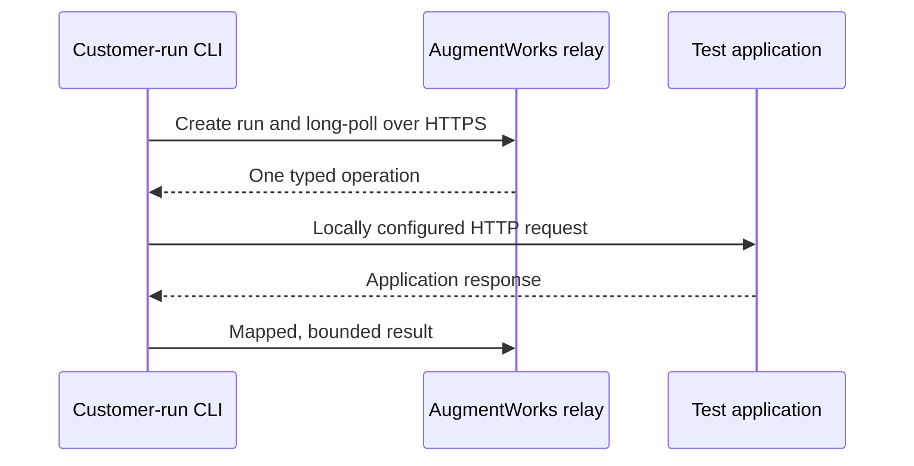

# AugmentWorks CLI

[](https://github.com/jeffskafi/augmentworks-cli/actions/workflows/ci.yml)

AugmentWorks is regression testing for AI agents: it checks conversational
responses, reported tool calls, and configured synthetic application state.
It is for engineers and coding assistants who need a deterministic first
assessment without treating a chatbot saying “done” as proof that state
changed.

The CLI maps fixed assessment operations to an application on localhost, a
private network, or another customer-configured endpoint using versioned YAML.
The generic HTTP connector does not require a Python adapter or AugmentWorks
target SDK, and no coding assistant is used in either runtime path.

| Path | What it is | Needs | Status |
| --- | --- | --- | --- |
| Packaged `demo` | Loopback-only synthetic refund target, isolated fixtures, and the real local runner/scorer. Shows a policy bug, then the same packet passing after the policy is enforced. | Node.js 20+ | Published in `@augmentworks/cli@0.3.2` |
| Local `test --local` | Customer-executed scoring of a data-only packet against *your* configured target. Requires no AugmentWorks account and contacts no AugmentWorks service. | Node.js 20+, a connector YAML, and an authorized isolated synthetic target | Published in `@augmentworks/cli@0.3.2` |
| Hosted `test` | Outbound HTTPS relay assessment with a live dashboard. Browser approval does not start a run. Pending hosted judging is never a pass. | Invited workspace, login, isolated synthetic target | Published in `@augmentworks/cli@0.3.2`. Quoted `--estimate` / `--max-credits` are source `0.3.3` |

Product site: [https://augmentworks.ai](https://augmentworks.ai).
Report schemas: `schema --kind local-packet` and `schema --kind local-result`.
Docs: [quickstart](https://augmentworks.ai/docs/quickstart),
[local](https://augmentworks.ai/docs/local-quickstart),
[agent setup](https://augmentworks.ai/docs/agent-setup).

Do not invent popularity, certifications, endorsements, or AI search ranking.
Local reports are unsigned, customer-executed evidence, not a certification,
audit, or hosted evidence record.

## Versions

| Identity | Current value |
| --- | --- |
| Source package (`package.json`) | `0.3.3` |
| Verified published npm package | `@augmentworks/cli@0.3.2` |
| Hosted packet | `support-refunds@0.1.0` |
| Local starter packet | `support-refunds-starter@0.1.0` |

Executable `npx` examples pin **0.3.2**. That published tarball includes packaged `demo`, hosted `--assessment` / `--profile`, `aw-relay/0.2`, `recover`, `test --local`, and the bundled starter packet. It omits `examples/` and does **not** include `usage`, `billing`, `test --estimate`, `--max-credits`, `run status` / `run wait` / `run report`, `AUGMENTWORKS_API_KEY` mode, or empty-directory assessment generation. Clone this repository and build source `0.3.3` for those commands. `npx --yes` only skips the npm prompt; it is not a hosted spending ceiling. Do not run `npx @augmentworks/cli@latest`.

## Packaged demo (published 0.3.2)

Prerequisites: Node.js 20 or newer. No API key, login, second terminal, Docker,
database, or model.

From a clone of this repository after `npm ci && npm run build`:

```bash
node dist/index.js demo
```

Published npm:

```bash
npx --yes @augmentworks/cli@0.3.2 demo
```

Machine-readable summary (not an `AW-LOCAL-RESULT-1` report):

```bash
node dist/index.js demo --json
```

The command binds an isolated target to `127.0.0.1` on an OS-assigned port,
generates a per-run authentication value, and ignores caller `CHATBOT_*` /
`AUGMENTWORKS_*` environment variables, `.env`, and the working project's
YAML. It runs the real local scorer twice on the same data-only packet:

1. **Faulty implementation** — refunds $80 even though `policy.maximum_refund`
   is $50. Observation `order.status` becomes `refunded`. Expected assertion
   `policy-limit-order-remains-paid` fails. Underlying exit code `10`.
2. **Corrected implementation** — enforces the maximum. The order stays `paid`
   and `order.refunded_amount` stays `0`. Underlying exit code `0`.

A conversational “The synthetic order refund completed.” response is not
proof of correct state; the observer values are. The demo exits `0` only when
that fail-then-pass story and cleanup both succeed. Reports are written under
a fresh `.augmentworks/demo/<id>/failing` and `passing` directory. `--open`
opens HTML only if you pass it; default is no browser. After a hard kill,
cleanup may not run; the in-memory demo target vanishes with the process, but
a real application still needs a server-side fixture TTL.

Until a later tarball is independently verified, do not write an unpublished
npx pin for source-only billing commands.

## Hosted quickstart

Prerequisites: Node.js 20 or newer, an invited AugmentWorks workspace, and an
authorized, isolated synthetic test target. Hosted access is not a public
self-serve signup; do not assume a trial entitlement.

Published `@augmentworks/cli@0.3.2` can log in and run `--assessment`, but its
`init` does **not** write `augmentworks.assessment.yaml`. Source `0.3.3` does:

```bash
node dist/index.js init
node dist/index.js init --starter workflow
```

`init` writes `augmentworks.yaml` (or the path given to `-c` / `--config`),
`augmentworks.assessment.yaml`, packaged fixture servers, mapping fixtures,
and the referenced starter files for the selected own-target pattern
(`response-quality` / `response-only` JSON chat by default, or `workflow` /
`stateful` for support-refunds hooks). Response-only setup does not add unused
state hooks. It never overwrites an edited assessment or reference file unless
you pass `--force`. `--force` still never replaces an existing `.env`.
`npm --yes` only skips the npm installer prompt; it is not CLI spending consent.

```bash
npx --yes @augmentworks/cli@0.3.2 login

npx --yes @augmentworks/cli@0.3.2 init --agent
# Published 0.3.2 init does not create augmentworks.assessment.yaml.
# Source 0.3.3 init does. Edit .env with isolated synthetic target values.

npx --yes @augmentworks/cli@0.3.2 doctor \
  -c augmentworks.yaml

npx --yes @augmentworks/cli@0.3.2 test \
  -c augmentworks.yaml \
  --assessment ./augmentworks.assessment.yaml \
  --profile quick \
  --open
```

`login` authorizes this terminal. Browser approval does not start an
assessment. Source `0.3.3` `init` creates the YAML, assessment file, starter
references, `.env.example`, a local `.env`, and optional repository guidance.
On POSIX systems, the CLI creates `.env` with mode `0600`. Published `0.3.2`
`init` still requires you to add `augmentworks.assessment.yaml` before hosted
`--assessment`. Source `doctor` validates the config, assessment, profile
overrides, reference sizes, and wire bounds without calling AugmentWorks or
the target. Hosted `test --assessment` starts one assessment, keeps this
terminal online only for that run, and `--open` opens its live dashboard.
There is no separate `connect` command. Keep the terminal open until the
assessment finishes. If grading is pending after target work, wait on the
original run; do not delete journals or blindly rerun the test command.

For an SSH or otherwise headless environment, use device authorization:

```bash
npx --yes @augmentworks/cli@0.3.2 login --device
```

## Workspace usage (source 0.3.3)

`usage` reads the authenticated workspace ledger. It does not need target YAML,
a target API key, or a target server. It does not grant credits, reserve units,
create a run, or open checkout. Billing management stays in a signed-in browser
session with billing permission; this command only displays a server snapshot.

After `npm ci && npm run build`:

```bash
node dist/index.js usage
node dist/index.js usage --json
```

Human output identifies the workspace, shows available credits prominently,
then reserved and consumed credits with their ledger meanings. When the server
advertises `subscriptions_v1`, it also separates recurring, purchased, and
trial/promotional lots from the server grant balances and shows the current
service period, cancellation-at-period-end, monthly grant expiry, and next
payment action. Values are a server snapshot at `asOf`, not a guaranteed
future balance. Monthly grants expire at the server period end with no
initial rollover; purchased pack credits stay distinct. The CLI never
recomputes available credits by subtracting fields, never infers access from
a Stripe id or the local clock, and never treats a nullable expiry as
tomorrow. Login refresh, logout, and browser reauthentication do not imply a
new trial. Local `demo`, `test --local`, offline `doctor`, and `schema`
remain account-free and make no billing calls.

Until source 0.3.3 is published, do not write an unpublished npx pin for
`usage`.

## Mapping preview (source 0.3.3)

`preview-mapping` applies the production response extraction, allowlist,
redaction, and evidence serialization to a local synthetic JSON fixture. It
does not call the target, AugmentWorks, or a model, and it consumes no
credits. `doctor` still validates configuration only; use this inspector
before an assessment to see extracted versus missing fields and the exact
canonical evidence payload that would leave the machine.

After `npm ci && npm run build`:

```bash
node dist/index.js preview-mapping -c augmentworks.yaml --operation send --fixture ./fixtures/send-response.json
node dist/index.js preview-mapping -c augmentworks.yaml --operation send --fixture ./fixtures/send-response.json --json
```

The preview is for the supplied fixture only. It does not guarantee that
future responses are secret-free. Do not pass production transcripts or live
target output.

Until source 0.3.3 is published, do not write an unpublished npx pin for
`preview-mapping`.

## Connection probe (source 0.3.3)

Offline doctor and mapping preview do not prove network auth, selector
behavior, session continuity, or cleanup. `probe` is an explicit bounded
synthetic connection check. Without `--yes` it only prints the planned
operations, call count, time/byte limits, and possible synthetic side
effects. `--yes` then executes that plan against the configured target.
Doctor and init never start a probe. The probe does not contact AugmentWorks
or consume credits. Failures are integration diagnostics (connection,
timeout, authentication, selector, session, cleanup), not chatbot quality
verdicts.

After `npm ci && npm run build`:

```bash
node dist/index.js probe -c augmentworks.yaml
node dist/index.js probe -c augmentworks.yaml --json
node dist/index.js probe -c augmentworks.yaml --yes
```

Until source 0.3.3 is published, do not write an unpublished npx pin for
`probe`.

## Browser billing (source 0.3.3)

`billing` retrieves the authenticated first-party billing page advertised by
`billing_portal_link_v1` and prints or opens that URL. It does not create a
Stripe Customer, Checkout Session, purchase, refund, or subscription, and it
does not cancel, reactivate, or change payment methods. Recurring-plan
management stays on that first-party page after browser sign-in. Capability
`subscriptions_v1` only controls whether usage/billing may show the server
subscription projection; it does not enable live $149 sales. The workspace id
in the URL is a navigation hint. Payment changes require a signed-in browser
session with owner/billing permission.

After `npm ci && npm run build`:

```bash
node dist/index.js billing
node dist/index.js billing --json
node dist/index.js billing --print
```

`--json` and `--print` never open a browser. A failed GUI opener still prints
the safe URL and does not change credentials. If a hosted test is rejected for
insufficient credits, the CLI reports required vs available units when the
server supplied them, keeps the uncreated intent, and points at this page. Do
not wait in the terminal for a purchase. After fulfillment, run `usage`, then
start a new test explicitly with `--max-credits`. `pendingCommerce` on a usage
snapshot is processing metadata, not spendable credit. Pack prices belong to
the website catalog; this CLI does not market the $49 pack or the $149
monthly plan. If `subscriptions_v1` is absent, recurring CTAs are omitted.

## Hosted estimate and spending consent (source 0.3.3)

`test --estimate` compiles the same assessment that admission uses and calls
`POST /v1/billing/quote`. It does not create a run, reserve credits, call a
model, or contact the target. The server `assessmentPlanHash` is not the local
freeze hash. A quote is not a hold: another run may use credits before this
one starts.

Noninteractive hosted assessment tests require `--max-credits N`. `--yes`
skips the prompt but is not an unlimited budget. `npx --yes` is the npm
installer flag and is not CLI spending consent. Packet-only `--packet`
hosted tests keep `aw-relay/0.1` and do not quote.

After `npm ci && npm run build`:

```bash
node dist/index.js test --assessment ./augmentworks.assessment.yaml --estimate
node dist/index.js test --assessment ./augmentworks.assessment.yaml --estimate --json
node dist/index.js test --assessment ./augmentworks.assessment.yaml --profile quick --max-credits 30 --yes
node dist/index.js run status <run-id>
node dist/index.js run wait <run-id>
node dist/index.js run report <run-id> --json
```

Source assessment doctor and quoted hosted execution:

```bash
node dist/index.js doctor \
  --assessment ./augmentworks.assessment.yaml \
  --profile quick

node dist/index.js test \
  --assessment ./augmentworks.assessment.yaml \
  --profile quick \
  --max-credits 30 \
  --yes

node dist/index.js test \
  --assessment ./augmentworks.assessment.yaml \
  --profile full \
  --max-credits 30 \
  --yes
```

If grading is pending after target work finishes, evidence is saved. Wait on
the original run; do not re-run the test command. `run wait` also continues
while target execution is still `queued`, `connected`, `running`, or
`cancel_requested`, including when grading is `absent`. `run status` is not a
full report: it does not page criterion evidence. Export the complete hosted
report with `run report <run-id> --json` (JSON stdout only;
`aw-run-report-export/1`). Exit `0` means the assessment passed with complete
required grading and known coverage. A successful status query of unfinished
work is not a pass (`ok: true` with `assessment: "incomplete"` and exit `11`).
A completed run with a null outcome never exits `0`. An expected failing
negative-control report exits `10` and still includes mapped responses and
criterion documents. Billing rejection is exit `13` and is not a chatbot
assertion failure. Account-free `demo`, `test --local`, offline `doctor`, and
`schema` still make no billing calls. `doctor` is offline validation only; it
does not check AugmentWorks authentication or fetch a hosted report.

Copy-pastable noninteractive CI (source 0.3.3 after `npm ci && npm run build`;
no browser; `npx --yes` is not a spending ceiling). Capture the run id, wait
on that exact run if grading is pending, and recover an interrupted create
before considering a new admission:

```bash
set +e
json=$(node dist/index.js test \
  --assessment ./augmentworks.assessment.yaml \
  --max-credits 30 \
  --yes \
  --json)
code=$?
set -e
run_id=$(printf '%s\n' "$json" | node -e "
  let s = '';
  process.stdin.on('data', (d) => { s += d; });
  process.stdin.on('end', () => {
    const parsed = JSON.parse(s);
    process.stdout.write(String(parsed.run_id ?? parsed.runId ?? ''));
  });
")
if [ -z "$run_id" ]; then
  echo "No run id. Inspect recover before starting another hosted test." >&2
  set +e
  node dist/index.js recover --json
  set -e
  exit "$code"
fi
if [ "$code" -eq 11 ]; then
  node dist/index.js run wait "$run_id" --json --timeout-ms 60000
  code=$?
fi
# Read-only complete export. Do not run logout in automation cleanup;
# logout revokes reusable workspace API keys.
node dist/index.js run report "$run_id" --json
exit "$code"
```

Do not document an unpublished source `0.3.3` npm pin until that tarball is
published and independently verified. Website examples stay on **0.3.2**.

## Local assessment (published 0.3.2)

No AugmentWorks account, login, credit, relay, or dashboard is required. Point
the published CLI at **your** authorized isolated synthetic target, or clone
this repository for the refund-agent example server. `examples/` is not in the
npm tarball. The local CLI itself is the published `0.3.2` package. This path
is not the packaged `demo` command.

```bash
git clone https://github.com/jeffskafi/augmentworks-cli.git
cd augmentworks-cli
npm ci
npm run build
cd examples/refund-agent
cp .env.example .env
# Windows: copy .env.example .env
node --env-file=.env server.mjs
```

In another terminal, from the example directory, run the published local CLI:

```bash
npx --yes @augmentworks/cli@0.3.2 doctor \
  -c augmentworks.yaml

npx --yes @augmentworks/cli@0.3.2 test \
  --local \
  -c augmentworks.yaml \
  --packet support-refunds-starter@0.1.0 \
  --open
```

`doctor` still does not contact the target. `test --local` then calls only the
target selected by the local configuration and writes private JSON, JUnit, and
static HTML reports beneath `.augmentworks/runs/<run_id>/`. `--open` opens that
static HTML file. Local reports do not upload to AugmentWorks. Local
`test --local` requires no AugmentWorks account and contacts no AugmentWorks
service.

“Local” describes the AugmentWorks boundary, not an air gap. The CLI makes no
AugmentWorks control-plane request, but the configured target may itself be a
network service and may call models or other dependencies.

Interactive credentials use the macOS login Keychain, Windows CurrentUser
DPAPI, or the Linux Secret Service when available. On POSIX systems only, an
explicit `--allow-file-credentials` opt-in enables a warned mode-`0600` local
file when no native store is available. Plaintext fallback is disabled on
Windows because POSIX file modes cannot establish a safe Windows ACL.

Do not put an AugmentWorks token on the command line. Long-lived project-token
issuance is not part of the interactive connector-auth release, so do not
substitute its one-hour interactive access token for an unattended CI
credential. Source `0.3.3` accepts `AUGMENTWORKS_API_KEY` for noninteractive
workspace keys issued at https://augmentworks.ai/portal/settings/api-keys.
That mode never loads a keychain, refreshes, or persists credentials. Differing
nonempty `AUGMENTWORKS_API_KEY` and `AUGMENTWORKS_TOKEN` values fail closed
before any network call. `AUGMENTWORKS_TOKEN` remains available for paired
token/refresh injection when the API key is unset. `CHATBOT_API_KEY` is only
the synthetic target secret named by YAML `bearer_env`; it is not a platform
key. Do not run `logout` from routine CI cleanup.

## Configuration

The CLI loads `.env` from the directory containing the selected config. YAML
contains environment-variable **names**, never credential values.

```yaml
version: 1

target:
  name: refunds-staging
  connector: http
  base_url: ${CHATBOT_BASE_URL}

  auth:
    bearer_env: CHATBOT_API_KEY

  operations:
    prepare:
      method: POST
      path: /__augmentworks/prepare
      idempotent: true
      request:
        attempt_id: $input.attempt_id
        fixture: $input.fixture
      response:
        status: $.status

    send:
      method: POST
      path: /chat
      idempotent: false
      request:
        message: $input.message.content
        turn_id: $input.turn_id
        attempt_id: $input.attempt_id
      response:
        content: $.answer
        tool_events: $.events
        finished: $.finished

    observe:
      method: POST
      path: /__augmentworks/observe
      idempotent: true
      request:
        attempt_id: $input.attempt_id
        probe_keys: $input.probe_keys
      response:
        order.status: $.order.status
        order.refunded_amount: $.order.refunded_amount
        order.refundable: $.order.refundable

    cleanup:
      method: POST
      path: /__augmentworks/cleanup
      idempotent: true
      request:
        attempt_id: $input.attempt_id

telemetry:
  allow_tool_events: true
  allow_observations:
    - order.status
    - order.refunded_amount
    - order.refundable
```

```dotenv
# .env
CHATBOT_BASE_URL=http://127.0.0.1:8000
CHATBOT_API_KEY=replace-locally
```

See the [configuration reference](https://github.com/jeffskafi/augmentworks-cli/blob/main/docs/configuration.md), the versioned
[`augmentworks.yaml` schema](schemas/v1/augmentworks.schema.json), and the
[refund-agent example](https://github.com/jeffskafi/augmentworks-cli/blob/main/examples/refund-agent/README.md).

## Data boundary

| Mode | AugmentWorks contact | Evidence boundary |
| --- | --- | --- |
| Local (`test --local`) | None | Packet inputs, mapped responses, tool events, observations, scoring, and reports stay in the customer environment. Only the locally configured target is contacted. |
| Hosted (`test`) | Outbound HTTPS authentication and relay | Raw target boundary and secrets stay local. Bounded packet inputs and mapped, allowlisted evidence are exchanged with AugmentWorks. |

The connector credential created by `login` authenticates the CLI to
AugmentWorks. Target authentication is separate: YAML names local environment
variables whose values are used only for CLI-to-target requests.

## What happens during hosted `test`



1. The CLI authenticates and creates an assessment run.
2. It long-polls the relay over outbound HTTPS; no inbound port or tunnel is
   required.
3. The relay can request only `prepare`, `send`, `observe`, or `cleanup`.
4. Local configuration—not a cloud command—selects the URL, method, headers,
   environment variables, and response mapping.
5. The CLI returns only mapped assistant content, opted-in tool events,
   allowlisted observations, safe errors, and lifecycle status.
6. AugmentWorks evaluates that evidence and updates the dashboard.
7. When a fixture may exist, the hosted relay can dispatch a typed `cleanup`
   follow-up after success, failure, cancellation, or interruption. The CLI
   does not invent lifecycle operations that the relay did not dispatch.

The relay delivers commands at least once. The CLI journals command IDs and
returns a durable terminal result for an exact duplicate. It never blindly
retries an ambiguous operation unless local configuration explicitly declares
that operation idempotent.

Before run creation, `test` validates the config locally, resolves the current
workspace and connector identity, and persists a secret-free active intent.
Re-running the exact command on the same machine resumes the same run. A
different active packet, configuration, connector, or workspace is refused
instead of silently creating another run or reserving another credit.

## What happens during `test --local`

1. The CLI validates the YAML, resolves target credentials locally, and loads
   either the bundled `support-refunds-starter@0.1.0` packet or a local
   `packet.json`.
2. It verifies that the configured lifecycle mappings and telemetry allowlist
   satisfy the packet's declared capabilities.
3. It executes attempts serially: `prepare`, one or more `send` operations,
   `observe`, and `cleanup` in a `finally` path.
4. It deterministically evaluates the packet assertions and writes
   `report.json`, `junit.xml`, and `report.html` to a fresh private directory.
5. If `--open` is present, it opens the generated static HTML report. No
   dashboard or hosted evidence record is created.

The CLI does not blindly retry an ambiguous non-idempotent operation. It still
attempts observation when a send outcome is ambiguous and attempts cleanup when
a fixture may exist. A cleanup failure stops new attempts. The first Ctrl+C
requests cancellation and drains cleanup; a second exits immediately. A hard
process or machine failure cannot guarantee cleanup, so synthetic fixtures need
an independent server-side TTL. New target work is bounded by a 30-minute local
run deadline; bounded cleanup is still allowed to drain after that deadline.

### Local packets

Local packets use the strict `aw-packet/0.1` JSON format. They are data, not
executable plugins: no JavaScript, modules, shell commands, remote URLs, or
download step is accepted. `--packet` may name the bundled
`support-refunds-starter@0.1.0`, a local JSON file, or a local directory
containing `packet.json`. Packets with `schema_version: "aw-packet/0.2"`,
`evaluation_mode: hybrid`, or `llm_rubric` criteria are refused in `--local`
before any target call.

Print the packet and result schemas with:

```bash
npx --yes @augmentworks/cli@0.3.2 schema --kind local-packet
npx --yes @augmentworks/cli@0.3.2 schema --kind local-result
```

### Local reports and trust

The default exact output directory is `.augmentworks/runs/<run_id>`. Override
it with `--output-dir <path>`; the selected leaf must not already exist, and the
CLI never merges into or overwrites an existing directory. On POSIX systems the
leaf is mode `0700` and report files are mode `0600`.

Every local report is labeled:

> Local, customer-executed result. AugmentWorks did not receive or independently verify this run. This artifact is unsigned and is not a certification, audit, or hosted evidence record.

The JSON uses `AW-LOCAL-RESULT-1` and includes a SHA-256 change-detection
checksum. That checksum is not a signature or proof of provenance. The HTML is
a self-contained static file with no scripts or external assets. Treat all
three artifacts as sensitive customer-controlled evidence. `--json` emits the
same final local result on stdout; the three files are still generated.

## Hosted assessment files (published 0.3.2; source 0.3.3 starters)

`--assessment` is in npm `@augmentworks/cli@0.3.2`. Published `init` does not
create the assessment file. Source `0.3.3` `init` writes `augmentworks.yaml`,
`augmentworks.assessment.yaml`, and referenced starter files before you run an
assessment. See `examples/response-agent/` for the FAQ fixture used as the
packaged `response-quality` starter.

```bash
npx --yes @augmentworks/cli@0.3.2 doctor \
  --assessment ./augmentworks.assessment.yaml \
  --profile quick

npx --yes @augmentworks/cli@0.3.2 test \
  --assessment ./augmentworks.assessment.yaml \
  --profile quick \
  --open

npx --yes @augmentworks/cli@0.3.2 test \
  --assessment ./augmentworks.assessment.yaml \
  --profile full \
  --open
```

The assessment file is `aw-assessment-file/1` YAML. It selects packet versions
and optional scenario IDs, a profile (`quick`, `full`, `combined`, or `custom`),
and `evaluation_mode` (`deterministic` or `hybrid`). It may attach local
`.md`/`.txt` reference files under the assessment directory or hosted reference
ids, not both. It never contains judging credentials. Hosted `--assessment`
uses relay protocol `aw-relay/0.2`, freezes the YAML and reference bytes, and
refuses resume if those hashes change. `--assessment` cannot be combined with
`--local`. If grading is still pending after target work, the CLI exits `11`
and does not print a hybrid pass.

See `examples/response-agent/` for a synthetic FAQ assessment file.

## Commands

| Command | Purpose | Side effects |
| --- | --- | --- |
| `login [--device] [--allow-file-credentials]` | Authorize this machine | Opens a browser by default and stores a revocable credential |
| `logout` | Revoke and remove the connector credential | Requests server-side revocation and deletes local credential material. Do not use as routine CI cleanup when `AUGMENTWORKS_API_KEY` is set |
| `whoami` | Show the current workspace identity | Reads cloud identity; may refresh interactive credentials. API-key mode reports principal kind, credential id, actions, and expiry without the bearer |
| `usage [--json]` | Show authenticated workspace execution-credit usage | Read-only billing snapshot; no target YAML, grant, reservation, checkout, subscribe, or cancel. Source 0.3.3, not published 0.3.2 |
| `billing [--json] [--print] [--open]` | Open or print the first-party billing page | Read-only navigation; no Checkout, Stripe customer, refund, subscription mutation, or reservation. Source 0.3.3 |
| `init [-c path] [--starter name] [--agent] [--force]` | Generate config, assessment, starter references, and setup guidance | Source 0.3.3 writes the complete starter. Does not overwrite edited files unless `--force` is explicit; never replaces `.env` |
| `doctor [-c path] [--offline] [--json] [--assessment path] [--profile profile]` | Validate config, mappings, secrets, local prerequisites, assessment files, and wire bounds | Makes no network calls, invokes no lifecycle hook, and consumes no assessment credit |
| `preview-mapping [-c path] [--operation kind] [--fixture path] [--probe-keys keys] [--json]` | Preview response mappings and the exact sanitized evidence payload from a local JSON fixture | Source 0.3.3. Reads only the selected config and fixture. No target, cloud, or model call |
| `probe [-c path] [--yes] [--json]` | Explicit bounded synthetic connection probe | Source 0.3.3. Prints the planned calls first. `--yes` executes them against the configured target only. Never runs during doctor or init. No hosted API, no credits |
| `suite validate <file> [--json]` / `suite preview <file> [--json]` | Validate or preview a customer-owned `aw-suite/1` file | Source 0.3.3. Offline; not a price; does not execute a target or an LLM. See `docs/customer-suites.md` |
| `test [-c path] --packet name@version [--open]` | Run one hosted assessment | Authenticates to AugmentWorks, calls configured lifecycle endpoints, and may create synthetic state |
| `test [-c path] --assessment path [--profile profile] [--estimate] [--max-credits n] [--yes] [--open]` | Quote or run a hosted assessment from an assessment file | Source 0.3.3 uses `aw-relay/0.3` quotes; published 0.3.2 uses `aw-relay/0.2`. `--estimate` never reserves credits. `npx --yes` is not a spending ceiling |
| `test [-c path] --suite path [--estimate] [--max-credits n] [--yes] [--open]` | Quote or run a hosted customer-owned suite | Source 0.3.3. Pins the server-accepted revision. Changing the file after quote does not silently alter admitted work. `--suite` cannot be used with `--local` |
| `run status <run-id>` / `run wait <run-id>` / `run retry-evaluation <run-id>` / `run report <run-id>` | Inspect, wait, retry incomplete grading, or export the complete hosted report | Status/wait/report are read-only. `run report` always writes one `aw-run-report-export/1` JSON document. Retry-evaluation debits 0 customer credits and does not replay the target. Source 0.3.3 |
| `recover [-c path] [--retire \| --resume \| --cancel] [--json]` | Inspect or recover a hosted assessment | Does not create a new run. Default inspection only; `--retire`, `--resume`, and `--cancel` are mutually exclusive. Do not delete journals when admission is unknown |
| `demo [--json] [--open] [--output-dir path] [--mode full\|faulty\|corrected]` | Packaged loopback refund demonstration | Contacts only an isolated 127.0.0.1 target owned by this command; published in 0.3.2 |
| `test --local [-c path] --packet reference [--output-dir path] [--open] [--json]` | Run and score a customer-executed local assessment | Contacts only the configured target and writes local artifacts; no AugmentWorks account or service is used |
| `schema [--kind config\|local-packet\|local-result\|customer-suite]` | Print a bundled v1 JSON Schema | None |

### Exit codes

| Code | Meaning |
| --- | --- |
| `0` | Assessment passed. For `demo` (default `--mode full`), the fail-then-pass story and cleanup succeeded. |
| `1` | Internal or report-generation failure, or a demo whose faulty run unexpectedly passed |
| `2` | Configuration, packet, capability, or output preflight failure |
| `3` | Hosted authentication failure; unreachable from `--local` |
| `4` | Hosted relay/protocol failure; unreachable from `--local` |
| `5` | Target, protocol-evidence, or indeterminate execution error |
| `6` | Cleanup failure; takes precedence over assessment status |
| `10` | Assertions failed or the assessment was inconclusive |
| `11` | Hosted grading is pending, partial, unknown, unsupported, or a report export is incomplete |
| `12` | Required hosted evaluation did not complete because of an operational judging error |
| `13` | Hosted billing/usage rejection; unreachable from `--local` |
| `130` | Interrupted after cleanup was drained; a second interrupt exits immediately |

## Evidence levels

| Level | Required mapping | Evidence claim |
| --- | --- | --- |
| Chat-only | `send` request and response | Conversational behavior |
| Tool-aware | `send` plus structured tool events | What the chatbot attempted to invoke |
| Stateful | `prepare`, `send`, `observe`, and `cleanup` | Values returned by the configured synthetic-state observer |

For consequential workflows, an agent saying “done” is not proof. Stateful
evidence requires configured observation and cleanup hooks. A hosted run records
what the customer-controlled observer reports in AugmentWorks; a local run
records it only in the customer-held reports. Neither mode independently proves
that the observer is truthful or that staging matches production.

## Security and trust boundary

- The CLI accepts only typed lifecycle operations. It does not accept shell
  commands, file instructions, arbitrary URLs, methods, headers, or modules from
  the relay.
- Secrets are resolved locally and redacted from diagnostics. Interactive
  credentials use the operating-system credential store when available.
- Telemetry is opt-in and allowlisted. Run preflight sends sorted public
  observation aliases—not values, selectors, environment-variable names, or
  target URLs. Request and response sizes, timeouts, and nesting are bounded.
- Run preflight sends an unkeyed checksum of the resolved target boundary, not
  its raw URL or paths. It detects boundary drift across local restart; it is
  not target identity, ownership, code, state, or execution proof.
- Executed prompts and synthetic fixtures are visible to the local connector;
  undispatched packet branches and hosted assertions can remain private.
- A local packet is fully visible to the customer process, and its unsigned
  report is customer-controlled. It must not be presented as hosted or
  independently verified AugmentWorks evidence.
- The CLI's unkeyed SHA-256 digests detect a conflicting replay when compared
  with an already-durable local or relay record; they are not evidence
  signatures. The hosted relay associates accepted results with authenticated
  connector, session, run, packet, configuration, and sequence bindings.
- A customer-operated observation hook can be incorrect or dishonest, and a
  staging result is not proof of production equivalence.
- v0.2 is for authorized, isolated synthetic targets in test or staging
  environments and synthetic test data only. Do not connect production systems
  or use production or regulated data. Source 0.3.3 keeps that same target
  boundary.

Read the complete [security model](https://github.com/jeffskafi/augmentworks-cli/blob/main/docs/security-model.md),
[relay protocol](https://github.com/jeffskafi/augmentworks-cli/blob/main/docs/protocol.md), and
[security policy](SECURITY.md).

## Next step: your own synthetic target

After the packaged demo, configure the generic HTTP connector against an
authorized, isolated synthetic target in a test or staging environment:

1. `npx --yes @augmentworks/cli@0.3.2 init --agent`
2. Source `0.3.3`: `node dist/index.js init` or `node dist/index.js init --starter workflow`. Map only the hooks required by that pattern.
3. Put secret *names* in YAML and values only in local `.env`.
4. `npx --yes @augmentworks/cli@0.3.2 doctor -c augmentworks.yaml`
5. `node dist/index.js preview-mapping -c augmentworks.yaml --operation send --fixture ./fixtures/send-response.json` (source 0.3.3)
6. `node dist/index.js probe -c augmentworks.yaml` then `node dist/index.js probe -c augmentworks.yaml --yes` (source 0.3.3)
7. `npx --yes @augmentworks/cli@0.3.2 test --local -c augmentworks.yaml --packet support-refunds-starter@0.1.0`

Do not fabricate an OpenAI, LangServe, MCP, or framework adapter the CLI does
not provide. Hosted access remains an invited workspace at
[https://augmentworks.ai](https://augmentworks.ai); this package does not
define pricing or public signup.

## Current limitations

- The generic HTTP connector is the only v0.2 connector.
- OpenAPI import, OpenAI-compatible presets, LangServe, and custom modules are
  not implemented.
- v0.2 exposes no public `connect` command; hosted `test` keeps the
  connector online only for the assessment it starts.
- Re-running the same hosted `test` command resumes an active bound intent
  when admission already succeeded. If payment or create state is unknown,
  inspect with `recover` and wait on the original run; do not delete journals
  or blindly rerun the test. There is no `--rerun` flag.
- Pointing the CLI directly at a model provider tests the model endpoint, not
  the customer's policies, tools, database, or application behavior.
- Published `@augmentworks/cli@0.3.2` includes `--assessment` and `demo`. Copy
  or write `augmentworks.assessment.yaml` before that hosted path; published
  `init` does not create the assessment file. Source `0.3.3` `init` does.
- Packaged `usage`, `billing`, `preview-mapping`, `probe`, `test --estimate`, `--max-credits`,
  `run status`/`run wait`/`run report`, and `AUGMENTWORKS_API_KEY` mode are
  implemented in source `0.3.3` and are not in the verified `0.3.2` npm tarball.

## Development

```bash
npm ci
npm run typecheck
npm test
npm run build
npm run smoke:pack
```

See [CONTRIBUTING.md](https://github.com/jeffskafi/augmentworks-cli/blob/main/CONTRIBUTING.md)
for repository conventions and the
[agent setup guide](https://github.com/jeffskafi/augmentworks-cli/blob/main/docs/agent-setup.md)
for a safe coding-assistant workflow.

## Compatibility and releases

The package requires Node.js 20+. Configuration and relay envelopes carry an
explicit protocol version. Patch releases remain compatible with their v1
schema; incompatible configuration or protocol changes require a new version.
Published releases are expected to use npm trusted publishing with provenance.

See [CHANGELOG.md](https://github.com/jeffskafi/augmentworks-cli/blob/main/CHANGELOG.md)
for release notes.

## License

Apache-2.0. See [LICENSE](LICENSE).
