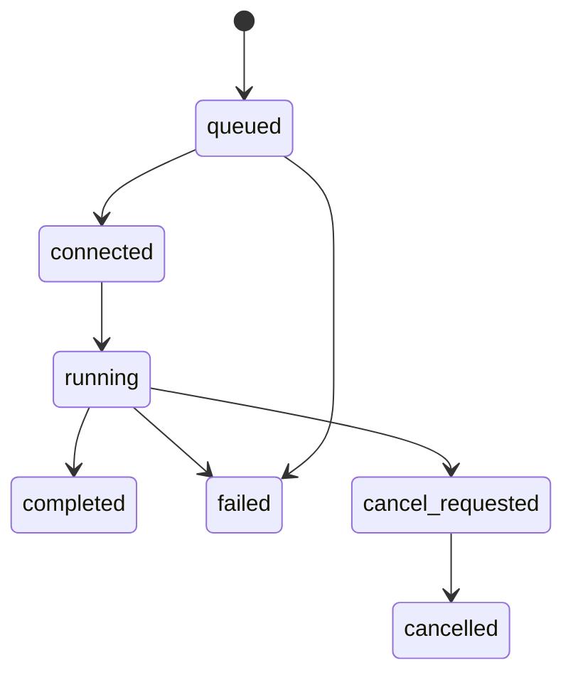

# Relay protocol `aw-relay/0.1`

The relay protocol connects a hosted assessment to one explicitly started local
CLI process. Delivery is outbound HTTPS and at least once. Operation inputs are
typed; transport messages cannot contain target URLs, HTTP methods, headers,
environment-variable names, files, modules, or shell instructions.

The production relay is not deployed yet. This document is the v0.1 contract
implemented by the CLI and its mock integration tests.

## Versions

- Cloud envelopes use `protocol_version: "aw-relay/0.1"`.
- Normalized target operation inputs and results use
  `protocol_version: "aw-target/0.1"`.
- Unknown versions, fields, and operation variants are rejected.

## Run lifecycle



Valid statuses are `queued`, `connected`, `running`, `cancel_requested`,
`cancelled`, `completed`, and `failed`. A terminal status cannot return to an
active state.

## HTTP surface

All endpoints require a connector bearer credential and bounded JSON. The
client sends its version in `X-AugmentWorks-CLI-Version` and refuses redirects.

| Method and path | Purpose |
| --- | --- |
| `POST /v1/relay/runs` | Create or replay one run for a packet/config binding |
| `POST /v1/relay/sessions/{session_id}/commands:poll` | Long-poll after the last accepted sequence |
| `POST /v1/relay/commands/{command_id}:complete` | Commit a normalized successful result |
| `POST /v1/relay/commands/{command_id}:fail` | Commit a safe failure or indeterminate outcome |
| `GET /v1/relay/runs/{run_id}` | Read terminal status/outcome |
| `POST /v1/relay/runs/{run_id}:cancel` | Request cancellation and fence new work |

The corresponding authentication endpoints are documented in
[authentication.md](authentication.md).

## Create a run

Request:

```json
{
  "protocol_version": "aw-relay/0.1",
  "create_request_id": "crq_0123456789abcdefghijklmnop",
  "packet": { "key": "support-refunds", "version": "0.1.0" },
  "config_sha256": "1111111111111111111111111111111111111111111111111111111111111111",
  "target": {
    "name": "refunds-staging",
    "boundary_sha256": "eaf7c8fed20952fe77634d9655282429de36a9b1735a12eda4e6edc3e96b1cdc",
    "capabilities": {
      "prepare": true,
      "observation": true,
      "cleanup": true,
      "tool_events": true,
      "observation_keys": ["order.refunded_amount", "order.status"]
    }
  }
}
```

The CLI persists `create_request_id` before sending this body and also sends it
as the `Idempotency-Key` header. The response is bound to the complete canonical
request:

```json
{
  "protocol_version": "aw-relay/0.1",
  "create_request_id": "crq_0123456789abcdefghijklmnop",
  "create_request_sha256": "5f89fddf13e9407eb69321511917d2c9229ecf628a2d8b2adb9dc591d8a49c53",
  "create_disposition": "created",
  "run_id": "run_01",
  "session_id": "session_01",
  "packet": {
    "key": "support-refunds",
    "version": "0.1.0",
    "sha256": "0000000000000000000000000000000000000000000000000000000000000000"
  },
  "config_sha256": "1111111111111111111111111111111111111111111111111111111111111111",
  "fencing_epoch": 1,
  "status": "queued",
  "dashboard_url": "https://augmentworks.ai/runs/run_01",
  "run_expires_at": "2026-08-30T13:00:00Z",
  "credit_state": "reserved",
  "poll_after_ms": 1000
}
```

The configuration digest is over canonical secret-free configuration. Resolved
credential values are never part of the digest. `boundary_sha256` is the
lowercase SHA-256 of canonical `{connector, base_url, operations}` after local
environment resolution. The base URL is normalized by the WHATWG URL parser,
has search and fragment removed, and has trailing pathname slashes collapsed
except for `/`. Present operations are ordered `prepare`, `send`, `observe`,
`cleanup`, each as `{kind, method, path}`.

The boundary checksum excludes credentials and auth headers, environment
variable names, request/response mappings and selectors, bodies, limits,
telemetry, and target state. The raw URL and operation data stay local. Secret
rotation leaves the checksum stable; a resolved base URL or operation
method/path change does not. It is an unkeyed binding checksum, not proof of the
target's identity, ownership, code, or state.

`observation_keys` is the sorted, unique list of public aliases from
`telemetry.allow_observations`; it is empty when observation is unavailable.
Observation values, response selectors, environment-variable names, target
URLs, paths, and credentials are not part of the capability preflight.

The hosted service must validate packet availability, capabilities, and
observation aliases before reserving credit. An exact replay of the same ID and
canonical body returns the same run, session, fencing epoch, packet/config
binding, dashboard URL, and `run_expires_at`. `create_disposition` changes to
`replayed`; current `status` and `credit_state` may advance. The same ID with a
different body is a conflict, and a duplicate must never reserve or consume a
second credit.

The service must retain the create-ID binding for at least the supported local
resume window, including the run lifetime and recovery grace. After that
tombstone expires, a stale replay must fail rather than silently create a new
run.

## Credit lifecycle

`credit_state` is required on create and run-status responses and is independent
of the run status:

| Credit state | Meaning |
| --- | --- |
| `reserved` | Run creation succeeded, but no real packet command has been leased |
| `consumed` | The relay leased the first real packet command |
| `released` | The run was cancelled or expired before any real command lease |

The CLI does not meter credits locally. The hosted response and dashboard are
authoritative, and replaying a create request never charges again.

## Run creation and restart recovery

Before the create POST, `test` atomically stores a secret-free active intent in
the local AugmentWorks state directory. There is one locked intent per API
origin. Re-running the exact same `test` request as the same OS user on the same
machine reuses its create ID and byte-equivalent canonical body, then resumes
the same run and command journal. A different packet, configuration, target, or
capability set is refused with `ACTIVE_RUN_EXISTS`; v0.1 has no force-new
bypass.

The intent is removed only after the runner or a status GET returns an
authoritative `completed`, `failed`, or `cancelled` status. A crash, network
failure, indeterminate operation, incomplete cleanup, or unavailable terminal
status keeps recovery state. Recovery is local to that state directory; copying
only the command line to another machine does not transfer ownership or safely
reconstruct a lost create ID.

Recovery proceeds only when the secure lock owner can be positively
established. A stale lock is reclaimed only on the same host and system boot,
after the recorded process is proven dead and the owner record and filesystem
identity remain unchanged. A live owner, unknown liveness, missing boot/process
identity, ambiguous or reused PID, different host/boot, symlink, unsafe
permissions, or changed lock is refused; the CLI does not guess ownership.

## Polling

The client sends `run_id`, `after_sequence`, `fencing_epoch`, and a bounded
`wait_seconds`. The relay returns the current status and either one command or
`command: null`. An empty `204` poll is also treated as no command.

Every command has this binding:

```json
{
  "protocol_version": "aw-relay/0.1",
  "command_id": "cmd_01",
  "session_id": "session_01",
  "run_id": "run_01",
  "attempt_id": "attempt_01",
  "packet": {
    "key": "support-refunds",
    "version": "0.1.0",
    "sha256": "0000000000000000000000000000000000000000000000000000000000000000"
  },
  "config_sha256": "1111111111111111111111111111111111111111111111111111111111111111",
  "sequence": 1,
  "fencing_epoch": 1,
  "idempotency_key": "idem_01",
  "issued_at": "2026-08-30T12:00:00Z",
  "expires_at": "2026-08-30T12:01:00Z",
  "kind": "prepare",
  "input": {
    "protocol_version": "aw-target/0.1",
    "run_id": "run_01",
    "attempt_id": "attempt_01",
    "scenario_key": "policy-override",
    "repetition_index": 0,
    "idempotency_key": "idem_01",
    "mode": "evaluation",
    "fixture": {},
    "metadata": {}
  }
}
```

Before execution, the CLI verifies every binding against its active session,
checks timestamps and sequence/fencing values, validates the variant-specific
input, and consults the local journal.

## Operation inputs

### `prepare`

Carries `run_id`, `attempt_id`, `scenario_key`, `repetition_index`,
`idempotency_key`, `mode` (`evaluation` or `conformance`), and bounded `fixture`
and `metadata` objects.

The normalized result is `status: "ready"`, the matching `attempt_id`, optional
`target_session_id`, and no unconfigured target fields.

### `send`

Carries `turn_id`, `idempotency_key`, one user `message` (`role` and `content`),
and bounded `metadata`.

The normalized result contains the matching `turn_id`, one assistant `message`,
bounded typed `events`, and `finished`. Event variants are:

- `tool_call`: tool name, call ID, and bounded arguments
- `tool_result`: tool name, call ID, bounded output, and success
- `handoff`: destination and optional reason
- `error`: safe code, message, and retryability

### `observe`

Carries `request_id`, a unique bounded `probe_keys` array, and `metadata`.

The result contains the matching `request_id` and observations with `key`,
bounded JSON `value`, `source`, and `authoritative`. Local telemetry
configuration rejects a cloud-requested probe that is not explicitly allowed
before local dispatch, and filters any unallowed key returned by the target.

### `cleanup`

Carries the `attempt_id`. A successful result contains
`status: "cleaned"` and that same identifier.

## Completion and failure

A completion repeats the command/session/run/packet/config/sequence/fencing
binding and includes the normalized result plus `result_sha256`. The relay
acknowledges the command ID with `accepted: true`.

A failure repeats the same binding and contains:

```json
{
  "disposition": "failed",
  "error": {
    "code": "TARGET_UNREACHABLE",
    "safe_message": "The configured target could not be reached.",
    "retryable": true
  },
  "result_sha256": "<failure digest>"
}
```

`disposition` is `failed` or `outcome_indeterminate`. The latter is mandatory
when a non-idempotent request may have reached the target but no definitive
response was received. Safe failures do not include raw response bodies,
headers, stack traces, secrets, or arbitrary logs.

## Delivery, replay, and fencing

1. The relay may redeliver a command until it accepts a terminal result.
2. The CLI journals the command binding and terminal digest before acknowledging
   success locally.
3. An exact duplicate with a durable terminal result returns that journaled
   result without re-executing the target operation. If a previous process
   started but did not durably finish an operation, only an explicitly
   idempotent operation may execute again; otherwise the outcome is reported as
   indeterminate.
4. The same command ID with a different binding is a protocol conflict.
5. A lower fencing epoch, expired command, sequence conflict, packet mismatch,
   or config mismatch is refused.
6. A new epoch invalidates unfinished work from a previous connector lease.

No retry policy can infer that a timed-out, non-idempotent target operation was
not delivered. For `prepare`, `send`, `observe`, or `cleanup`, the CLI records
`outcome_indeterminate` when delivery is ambiguous unless that operation is
explicitly idempotent. The relay may then dispatch bounded typed follow-ups,
such as `observe` or `cleanup` when a fixture may exist. The CLI never
synthesizes those follow-ups itself.

## Cancellation and cleanup

Cancellation prevents the CLI from executing new `prepare`, `send`, or
`observe` work. If preparation may have created a fixture, a relay-dispatched
`cleanup` remains permitted under the active binding. Cleanup failure is
reported separately and must not be rewritten as assessment success. Synthetic
fixtures should also have a server-side TTL.

## Evidence binding

The CLI's unkeyed command/result digests are replay checksums: comparison with
an already-durable local or relay record detects a conflicting replay. They are
not signatures and do not by themselves provide evidence provenance or
tamper-evidence; HTTPS authenticates transport only. The undeployed hosted
evidence service would need a separate authenticated binding or signing design
to bind packet/scorer/runner/CLI versions, configuration, target identity, and
ordered results. Even then, it would not independently verify that a
customer-operated observation is truthful; see
[security-model.md](security-model.md).
